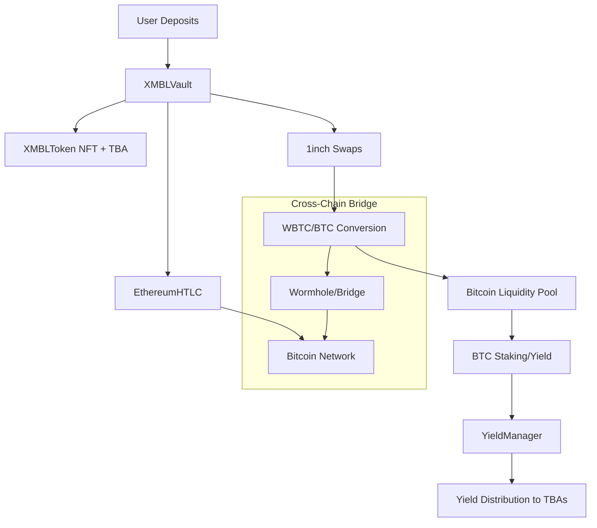

# XMBL Liquid Token - Smart Contracts

## Overview

The XMBL Liquid Token protocol is a sophisticated DeFi system that integrates with the upcoming XMBL platform for rapid app generation, p2p web services, and yield generation from staking BTC. Users deposit BTC or any supported tokens, which are converted to BTC and sent to the XMBL liquidity pool. When funds are deposited, XMBL NFTs are minted with Token Bound Accounts (ERC-6551) based on an algorithmic bonding curve. Each deposit creates a unique NFT with its own smart contract account that can hold assets, execute transactions, and manage DeFi positions independently.

Funds from the liquidity pool are rented out to earn basis points which are distributed as dividend yields to individual XMBL NFT holders via their Token Bound Accounts. Each NFT's TBA receives yields proportional to its deposit value, enabling sophisticated per-position portfolio management. The protocol utilizes 1inch APIs, contracts, and workflows to enable swaps and provision liquidity for yield generation.

## Architecture Overview

The protocol consists of five main contracts working together to convert deposits to BTC and generate yield:



## Core Contracts

### 1. XMBLToken.sol - ERC-721 NFT with Token Bound Accounts

**Purpose**: Governance and dividend-bearing NFT representing proportional ownership in the XMBL protocol. Each NFT has its own smart contract account (TBA) for advanced DeFi operations.

#### Key Features
- **ERC-6551 Token Bound Accounts**: Each NFT owns a smart contract wallet
- **Dividend Distribution**: Proportional yield distribution per NFT
- **Dynamic Metadata**: On-chain metadata with deposit information
- **Access Control**: Role-based permissions with pause functionality

#### Main Functions for Integration

```solidity
// Mint new XMBL NFT with TBA (only vault can call)
function mintWithTBA(address to, uint256 depositValue, address tokenAddress) external returns (uint256 tokenId)

// Get NFT data including TBA address
function getNFTData(uint256 tokenId) external view returns (NFTData memory)

// Get user's complete portfolio
function getUserPortfolio(address user) external view returns (Portfolio memory)

// Execute transaction through NFT's TBA
function executeTBACall(uint256 tokenId, address target, uint256 value, bytes calldata data) external returns (bytes memory)

// Burn NFT (for withdrawals)
function burn(uint256 tokenId) external
```

#### Data Structures

```solidity
struct NFTData {
    uint256 depositValue;    // ETH value of original deposit
    address tokenAddress;    // Original deposit token address
    address tbaAddress;      // Token Bound Account address
    address owner;           // Current NFT owner
    uint256 createdAt;       // Creation timestamp
}

struct Portfolio {
    uint256[] tokenIds;         // User's NFT token IDs
    NFTData[] nftData;         // Detailed data for each NFT
    uint256 totalDepositValue; // Total deposit value across all NFTs
}
```

#### Events for Monitoring

```solidity
event TokenBoundAccountCreated(uint256 indexed tokenId, address indexed account, address indexed owner);
event TokenBurned(uint256 indexed tokenId, address indexed owner);
event MinterUpdated(address indexed oldMinter, address indexed newMinter);
```

### 2. XMBLVault.sol - Main Protocol Contract

**Purpose**: Primary entry point for deposits, BTC conversion, NFT minting, and yield distribution. Implements bonding curve pricing, meta-token functionality, and coordinates the conversion of all deposited tokens to BTC for the liquidity pool.

#### Key Features
- **Multi-Token Deposits**: Supports BTC, ETH, and any ERC-20 token
- **BTC Conversion Pipeline**: Converts all deposits to BTC via 1inch swaps and cross-chain bridges
- **Bonding Curve Pricing**: Algorithmic pricing model with network fees (n satoshis per token n)
- **Meta-Token System**: Bulk minting for large deposits
- **Cross-Chain Integration**: Bridges WBTC to native BTC for the liquidity pool
- **Yield Distribution**: Proportional yield sharing among NFT holders from BTC staking rewards

#### Main Functions for Integration

```solidity
// Accept deposits and mint XMBL NFTs
function deposit(address token, uint256 amount) external payable

// Mint individual tokens from meta-token
function mintFromMetaToken(uint256 metaTokenId, uint256 tokensToMint) external

// Withdraw underlying assets by burning NFT
function withdraw(uint256 tokenId) external

// Claim accumulated yields for specific NFT
function claimYields(uint256 tokenId) external

// Claim yields for multiple NFTs
function claimMultipleYields(uint256[] calldata tokenIds) external

// Execute TBA transaction (only NFT owner)
function executeTBATransaction(uint256 tokenId, address to, uint256 value, bytes calldata data) external returns (bytes memory)

// Calculate current token price based on bonding curve
function calculateXMBLValue(uint256 totalMinted) external view returns (uint256)

// Get user's NFT IDs
function getUserNFTs(address user) external view returns (uint256[] memory)

// Get meta-token information
function getMetaTokenInfo(uint256 tokenId) external view returns (bool isMetaTokenFlag, uint256 mintableCount, uint256 startPosition)
```

#### Bonding Curve Economics

The protocol uses a simple linear bonding curve:
- Token n costs n satoshis + 1% network fee
- Token 1 = 1 satoshi, Token 2 = 2 satoshis, etc.
- 1 satoshi = 1e10 wei (conversion factor)

```solidity
function calculateXMBLValue(uint256 totalMinted) public view returns (uint256) {
    uint256 tokenNumber = totalMinted + 1;
    uint256 basePrice = tokenNumber * SATS_TO_WEI; // n satoshis in wei
    uint256 networkFee = (basePrice * NETWORK_FEE_BPS) / 10000; // 1% fee
    return basePrice + networkFee;
}
```

#### Events for Monitoring

```solidity
event Deposit(address indexed user, address indexed token, uint256 amount, uint256 tokensMinted, uint256 totalCost);
event Withdraw(address indexed user, uint256 tokenId, uint256 assetsReturned);
event YieldClaimed(uint256 indexed tokenId, address indexed owner, uint256 amount);
event NFTMinted(address indexed user, uint256 indexed tokenId, address tbaAddress);
event MetaTokenMinted(address indexed user, uint256 indexed tokenId, uint256 mintableCount, uint256 startPosition);
event YieldDistributed(uint256 totalYield, uint256 timestamp);
```

### 3. YieldManager.sol - DeFi Strategy Management

**Purpose**: Manages deployment of WBTC to various yield-generating protocols and harvests returns for distribution.

#### Key Features
- **Multi-Protocol Support**: Deploy funds to multiple DeFi protocols
- **Automatic Rebalancing**: Redistribute funds for optimal yields
- **Yield Harvesting**: Collect and distribute earned yields
- **Emergency Controls**: Pause and emergency withdrawal capabilities

#### Main Functions for Integration

```solidity
// Deploy funds to yield protocol (only vault)
function deployFunds(address protocol, uint256 amount) external

// Withdraw funds from protocol (only vault)
function withdrawFunds(address protocol, uint256 amount) external

// Harvest yield from all protocols
function harvestYield() external returns (uint256 totalHarvested)

// Rebalance positions across protocols
function rebalancePositions() external

// Get all active protocols
function getActiveProtocols() external view returns (address[] memory)

// Get detailed position information
function getActivePositions() external view returns (YieldPosition[] memory)

// Get total yield across all protocols
function getTotalYield() external view returns (uint256)
```

#### Data Structures

```solidity
struct YieldPosition {
    address protocol;  // Protocol address
    uint256 balance;   // Deployed balance
    uint256 yield;     // Accrued yield
    string apy;        // Current APY
}
```

#### Events for Monitoring

```solidity
event FundsDeployed(address indexed protocol, uint256 amount, uint256 timestamp);
event YieldHarvested(address indexed protocol, uint256 amount, uint256 timestamp);
event FundsWithdrawn(address indexed protocol, uint256 amount, uint256 timestamp);
event PositionsRebalanced(uint256 totalMoved, uint256 timestamp);
```

### 4. EthereumHTLC.sol - Cross-Chain Atomic Swaps

**Purpose**: Manages Ethereum side of atomic swaps for trustless Bitcoin ↔ Ethereum exchanges.

#### Key Features
- **Hash Time Locked Contracts**: Secure cross-chain swaps
- **Timelock Management**: Configurable time limits for swaps
- **Secret Revelation**: Claim mechanism with cryptographic proofs
- **Refund Protection**: Automatic refunds after timeout

#### Main Functions for Integration

```solidity
// Lock funds for atomic swap
function lockFunds(bytes32 hashlock, uint256 timelock, address recipient, uint256 amount) external payable

// Claim locked funds with secret
function claimFunds(bytes32 secret) external

// Refund funds after timelock expiry
function refundFunds(bytes32 hashlock) external

// Get swap details
function getSwapDetails(bytes32 hashlock) external view returns (SwapDetails memory)

// Check if swap is active
function isSwapActive(bytes32 hashlock) external view returns (bool)

// Generate hashlock from secret
function calculateHashlock(bytes32 secret) external pure returns (bytes32)
```

#### Data Structures

```solidity
struct SwapDetails {
    address initiator;  // Swap initiator
    address recipient;  // Intended recipient
    uint256 amount;     // Locked amount
    address token;      // Token address (0x0 for ETH)
    uint256 timelock;   // Expiry timestamp
    bool claimed;       // Whether funds were claimed
    bool refunded;      // Whether funds were refunded
    bytes32 secret;     // Revealed secret (if claimed)
}
```

#### Events for Monitoring

```solidity
event FundsLocked(bytes32 indexed hashlock, address indexed initiator, address indexed recipient, uint256 amount, uint256 timelock);
event FundsClaimed(bytes32 indexed hashlock, address indexed claimer, bytes32 secret);
event FundsRefunded(bytes32 indexed hashlock, address indexed initiator, uint256 amount);
```

### 5. Interface Contracts

#### I1inchFusion.sol - 1inch Integration Interface
Defines integration with 1inch Fusion+ for gasless, MEV-protected token swaps.

#### ILimitOrderProtocol.sol - Limit Order Interface
Interface for 1inch Limit Order Protocol integration.

#### IWormholeBridge.sol - Cross-Chain Bridge Interface
Interface for Wormhole cross-chain bridge integration.

## Deployment Information

### Network Configuration

```javascript
// Hardhat configuration
module.exports = {
  solidity: {
    version: "0.8.19",
    settings: {
      optimizer: {
        enabled: true,
        runs: 200,
      },
    },
  },
  networks: {
    hardhat: {
      chainId: 1337,
    },
  },
};
```

### Deployment Sequence

1. **Deploy XMBLToken** with ERC-6551 registry and TBA implementation
2. **Deploy YieldManager** with WBTC token address
3. **Deploy XMBLVault** with references to token, yield manager, and oracles
4. **Deploy EthereumHTLC** for atomic swap functionality
5. **Initialize contracts** with proper permissions and configurations

### Environment Variables Required

```bash
# Deployment
PRIVATE_KEY=<deployer_wallet_private_key>
INFURA_API_KEY=<ethereum_node_provider_key>
ETHERSCAN_API_KEY=<contract_verification_key>

# Contract Addresses (mainnet/testnet)
WBTC_ADDRESS=<wrapped_bitcoin_token_address>
ERC6551_REGISTRY=<erc6551_registry_address>
TBA_IMPLEMENTATION=<token_bound_account_implementation>
ONE_INCH_ORACLE=<1inch_price_oracle_address>
ONE_INCH_ROUTER=<1inch_aggregation_router>
```

## Integration Guide for Server Team

### 1. Contract Interaction Setup

```typescript
// Contract ABI imports
import XMBLVaultABI from './abis/XMBLVault.json';
import XMBLTokenABI from './abis/XMBLToken.json';
import YieldManagerABI from './abis/YieldManager.json';

// Contract instances
const vaultContract = new ethers.Contract(VAULT_ADDRESS, XMBLVaultABI, provider);
const tokenContract = new ethers.Contract(TOKEN_ADDRESS, XMBLTokenABI, provider);
const yieldContract = new ethers.Contract(YIELD_ADDRESS, YieldManagerABI, provider);
```

### 2. Event Monitoring

```typescript
// Monitor deposits
vaultContract.on('Deposit', (user, token, amount, tokensMinted, totalCost) => {
  // Handle new deposit
  console.log(`User ${user} deposited ${amount} ${token}, minted ${tokensMinted} tokens`);
});

// Monitor yield claims
vaultContract.on('YieldClaimed', (tokenId, owner, amount) => {
  // Handle yield claim
  console.log(`Token ${tokenId} claimed ${amount} yield`);
});

// Monitor NFT minting
vaultContract.on('NFTMinted', (user, tokenId, tbaAddress) => {
  // Handle new NFT
  console.log(`NFT ${tokenId} minted for ${user} with TBA ${tbaAddress}`);
});
```

### 3. Yield Distribution Service

```typescript
async function distributeYields(totalYield: bigint) {
  const tx = await vaultContract.distributeYields(totalYield, {
    value: totalYield,
    gasLimit: 500000
  });
  await tx.wait();
}
```

### 4. Portfolio Queries

```typescript
async function getUserPortfolio(userAddress: string) {
  const portfolio = await tokenContract.getUserPortfolio(userAddress);
  return {
    tokenIds: portfolio.tokenIds,
    nftData: portfolio.nftData,
    totalDepositValue: portfolio.totalDepositValue
  };
}
```

## Integration Guide for Client Team

### 1. Contract Connection

```typescript
// Web3 service setup
class Web3Service {
  private vaultContract: Contract;
  private tokenContract: Contract;
  
  constructor(provider: Web3Provider) {
    this.vaultContract = new Contract(VAULT_ADDRESS, XMBLVaultABI, provider);
    this.tokenContract = new Contract(TOKEN_ADDRESS, XMBLTokenABI, provider);
  }
}
```

### 2. Deposit Flow

```typescript
async function deposit(tokenAddress: string, amount: bigint) {
  const signer = provider.getSigner();
  const vaultWithSigner = vaultContract.connect(signer);
  
  if (tokenAddress === ZERO_ADDRESS) {
    // ETH deposit
    return await vaultWithSigner.deposit(ZERO_ADDRESS, 0, { value: amount });
  } else {
    // ERC-20 deposit
    const tokenContract = new Contract(tokenAddress, ERC20_ABI, signer);
    await tokenContract.approve(VAULT_ADDRESS, amount);
    return await vaultWithSigner.deposit(tokenAddress, amount);
  }
}
```

### 3. Portfolio Display

```typescript
async function loadUserPortfolio(userAddress: string) {
  const portfolio = await tokenContract.getUserPortfolio(userAddress);
  
  return portfolio.nftData.map(nft => ({
    tokenId: nft.tokenId,
    depositValue: formatEther(nft.depositValue),
    tokenAddress: nft.tokenAddress,
    tbaAddress: nft.tbaAddress,
    createdAt: new Date(nft.createdAt * 1000)
  }));
}
```

### 4. Yield Claiming

```typescript
async function claimYields(tokenIds: number[]) {
  const signer = provider.getSigner();
  const vaultWithSigner = vaultContract.connect(signer);
  
  if (tokenIds.length === 1) {
    return await vaultWithSigner.claimYields(tokenIds[0]);
  } else {
    return await vaultWithSigner.claimMultipleYields(tokenIds);
  }
}
```

### 5. Real-time Updates

```typescript
// Subscribe to events for real-time UI updates
function subscribeToEvents() {
  vaultContract.on('Deposit', (user, token, amount, tokensMinted, totalCost) => {
    if (user === currentUserAddress) {
      refreshPortfolio();
    }
  });
  
  vaultContract.on('YieldClaimed', (tokenId, owner, amount) => {
    if (owner === currentUserAddress) {
      updateYieldBalance(tokenId, amount);
    }
  });
}
```

## Gas Optimization Guidelines

### 1. Batch Operations
- Use `claimMultipleYields()` instead of multiple single claims
- Consider `batchMintWithTBA()` for bulk operations

### 2. Gas Estimates
```typescript
// Typical gas costs
const GAS_ESTIMATES = {
  deposit: 300000,
  withdraw: 200000,
  claimYields: 150000,
  mintFromMeta: 250000
};
```

### 3. Transaction Timing
- Harvest yields during low gas periods
- Batch user operations when possible
- Use EIP-1559 for better fee estimation

## Security Considerations

### 1. Access Control
- Vault contract is the only minter for XMBLToken
- YieldManager requires vault authorization for fund deployment
- Emergency pause functionality in all contracts

### 2. Slippage Protection
- 1inch integration includes slippage protection
- Bonding curve prevents price manipulation
- Timelock mechanisms for HTLC operations

### 3. Reentrancy Protection
- All state-changing functions use ReentrancyGuard
- External calls happen after state updates
- Proper CEI (Checks-Effects-Interactions) pattern

## Testing and Verification

### 1. Running Tests
```bash
# Install dependencies
npm install

# Compile contracts
npx hardhat compile

# Run test suite
npx hardhat test

# Run with gas reporting
REPORT_GAS=true npx hardhat test
```

### 2. Local Development
```bash
# Start local node
npx hardhat node

# Deploy to local node
npx hardhat run scripts/deploy.js --network localhost
```

### 3. Contract Verification
```bash
# Verify on Etherscan
npx hardhat verify --network sepolia <CONTRACT_ADDRESS> <CONSTRUCTOR_ARGS>
```

## Troubleshooting

### Common Issues

1. **Transaction Reverts**
   - Check gas limits and user permissions
   - Verify contract is not paused
   - Ensure proper token approvals

2. **Event Monitoring**
   - Confirm correct contract addresses
   - Check block confirmation requirements
   - Verify network connectivity

3. **Yield Distribution**
   - Ensure vault has sufficient ETH balance
   - Check YieldManager permissions
   - Verify protocol harvest functionality

### Support Resources

- **Contract ABIs**: Available in `artifacts/contracts/` after compilation
- **Test Examples**: See `test/` directory for integration examples
- **Deployment Logs**: Check deployment script outputs for addresses
- **Block Explorer**: Use Etherscan for transaction debugging

## Conclusion

The XMBL Liquid Token protocol provides a sophisticated DeFi infrastructure with ERC-6551 Token Bound Accounts, automated yield management, and cross-chain capabilities. This documentation should provide the server and client teams with all necessary information for successful integration.

For additional support or questions, please refer to the test files in the `test/` directory for detailed integration examples.
